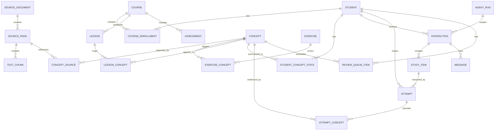

# Data Model

## 1. Data-model principles

1. Preserve raw evidence before computing summaries.
2. Keep source content, course timeline, student evidence, and messaging records separate.
3. Store timestamps in UTC and evaluate user-facing time in Europe/Stockholm.
4. Preserve provenance and import versions.
5. Derived state must be recomputable.
6. Keep the MVP one-user but include stable IDs rather than hard-coding William into logic.

## 2. Entity overview



## 3. Core tables

### `students`

| Field | Type | Notes |
|---|---|---|
| `id` | UUID | Stable identifier |
| `display_name` | text | William for MVP |
| `timezone` | text | `Europe/Stockholm` |
| `message_style` | JSONB | Brevity, tone, notation preferences |
| `quiet_hours` | JSONB | Local start/end and enabled days |
| `proactive_enabled` | boolean | Emergency pause |
| `created_at` | timestamptz | |
| `updated_at` | timestamptz | |

### `courses`

| Field | Type | Notes |
|---|---|---|
| `id` | UUID | |
| `name` | text | Exact course name |
| `external_provider` | text | `canvas` or `manual` |
| `external_id` | text nullable | Canvas course ID |
| `timezone` | text | Course-local timezone |
| `status` | text | active/completed |
| `last_synced_at` | timestamptz nullable | |

### `course_enrollments`

Links the student to the course, even though the MVP has one row.

| Field | Type |
|---|---|
| `student_id` | UUID |
| `course_id` | UUID |
| `role` | text |
| `started_at` | date nullable |
| `ended_at` | date nullable |

### `source_documents`

| Field | Type | Notes |
|---|---|---|
| `id` | UUID | |
| `kind` | text | textbook, answer_key, teacher_file |
| `title` | text | |
| `storage_key` | text | Private object location |
| `checksum` | text | Immutable content identity |
| `version` | integer | Import version |
| `license_note` | text nullable | Personal-use limitations |
| `import_status` | text | pending/processing/reviewed/failed |
| `created_at` | timestamptz | |

### `source_pages`

| Field | Type | Notes |
|---|---|---|
| `id` | UUID | |
| `document_id` | UUID | |
| `file_page_number` | integer | PDF page index |
| `printed_page_number` | text nullable | Book page label |
| `extracted_text` | text nullable | |
| `page_image_key` | text nullable | Private storage |
| `extraction_confidence` | numeric nullable | |
| `verified_at` | timestamptz nullable | |

### `text_chunks`

| Field | Type | Notes |
|---|---|---|
| `id` | UUID | |
| `source_page_id` | UUID | |
| `chunk_type` | text | explanation/example/exercise/solution |
| `content` | text | |
| `embedding` | vector | Dimension selected by model |
| `metadata` | JSONB | headings, exercise number, bounding box |
| `verification_state` | text | |

### `concepts`

| Field | Type | Notes |
|---|---|---|
| `id` | UUID | |
| `slug` | text unique | e.g. `factor-theorem` |
| `name` | text | |
| `description` | text | Internal concise definition |
| `parent_concept_id` | UUID nullable | Hierarchy |
| `course_id` | UUID nullable | Course-specific taxonomy if needed |
| `status` | text | draft/verified |

### `concept_prerequisites`

| Field | Type |
|---|---|
| `concept_id` | UUID |
| `prerequisite_concept_id` | UUID |
| `strength` | numeric |
| `source` | text |
| `verified` | boolean |

### `concept_sources`

| Field | Type |
|---|---|
| `concept_id` | UUID |
| `source_page_id` | UUID |
| `text_chunk_id` | UUID nullable |
| `relation` | text |
| `confidence` | numeric |
| `verification_state` | text |

### `exercises`

| Field | Type | Notes |
|---|---|---|
| `id` | UUID | |
| `source_page_id` | UUID | |
| `exercise_number` | text nullable | |
| `prompt` | text | Preserve exact source text |
| `answer_payload` | JSONB nullable | Structured expected answer |
| `solution_text` | text nullable | |
| `difficulty` | text nullable | easy/medium/hard |
| `grading_strategy` | text | numeric/symbolic/multiple_choice/rubric |
| `verification_state` | text | |

### `exercise_concepts`

| Field | Type |
|---|---|
| `exercise_id` | UUID |
| `concept_id` | UUID |
| `weight` | numeric |
| `role` | text | primary/prerequisite/transfer |

### `lessons`

| Field | Type | Notes |
|---|---|---|
| `id` | UUID | |
| `course_id` | UUID | |
| `external_id` | text nullable | Canvas ID |
| `title` | text | |
| `description` | text nullable | |
| `starts_at` | timestamptz nullable | |
| `ends_at` | timestamptz nullable | |
| `source_state` | text | confirmed/manual/inferred |
| `source_snapshot_id` | UUID nullable | |
| `updated_at` | timestamptz | |

### `lesson_concepts`

| Field | Type |
|---|---|
| `lesson_id` | UUID |
| `concept_id` | UUID |
| `relation` | text | prerequisite/current/follow_up |
| `confidence` | numeric |
| `mapping_method` | text | manual/rule/model |
| `verified` | boolean |

### `assessments`

| Field | Type |
|---|---|
| `id` | UUID |
| `course_id` | UUID |
| `title` | text |
| `due_at` | timestamptz |
| `coverage_text` | text nullable |
| `external_id` | text nullable |
| `source_state` | text |

### `assessment_concepts`

| Field | Type |
|---|---|
| `assessment_id` | UUID |
| `concept_id` | UUID |
| `weight` | numeric nullable |
| `confidence` | numeric |
| `verified` | boolean |

## 4. Learning evidence tables

### `interactions`

Represents one study interaction, which may contain one or several questions/messages.

| Field | Type |
|---|---|
| `id` | UUID |
| `student_id` | UUID |
| `course_id` | UUID |
| `mode` | text |
| `trigger_type` | text |
| `status` | text | planned/sent/active/completed/expired/cancelled |
| `reason_payload` | JSONB |
| `planned_for` | timestamptz nullable |
| `started_at` | timestamptz nullable |
| `completed_at` | timestamptz nullable |
| `idempotency_key` | text unique |
| `agent_run_id` | UUID nullable |

### `study_items`

| Field | Type |
|---|---|
| `id` | UUID |
| `interaction_id` | UUID |
| `sequence_number` | integer |
| `prompt` | text |
| `expected_answer` | JSONB |
| `grading_strategy` | text |
| `difficulty` | text |
| `generation_method` | text |
| `source_refs` | JSONB |
| `validation_state` | text |
| `renderer_payload` | JSONB nullable |

### `study_item_concepts`

| Field | Type |
|---|---|
| `study_item_id` | UUID |
| `concept_id` | UUID |
| `role` | text |
| `weight` | numeric |

### `attempts`

| Field | Type | Notes |
|---|---|---|
| `id` | UUID | |
| `study_item_id` | UUID | |
| `student_id` | UUID | |
| `raw_response` | text | Never replaced by normalized answer |
| `normalized_response` | JSONB nullable | |
| `submitted_at` | timestamptz | |
| `response_time_ms` | integer nullable | |
| `hint_count` | integer | |
| `evaluation_status` | text | pending/evaluated/manual_review |
| `correctness` | numeric nullable | 0–1 |
| `evaluation_confidence` | numeric nullable | |
| `feedback_text` | text nullable | |
| `evaluator_version` | text nullable | |

### `attempt_concepts`

| Field | Type |
|---|---|
| `attempt_id` | UUID |
| `concept_id` | UUID |
| `evidence_type` | text | positive/negative/uncertain |
| `evidence_strength` | numeric |
| `notes` | text nullable |

### `misconception_evidence`

| Field | Type |
|---|---|
| `id` | UUID |
| `student_id` | UUID |
| `concept_id` | UUID |
| `misconception_code` | text |
| `attempt_id` | UUID |
| `confidence` | numeric |
| `status` | text | candidate/active/resolved/rejected |
| `created_at` | timestamptz |

### `student_concept_states`

Derived cache; recomputable from attempts.

| Field | Type |
|---|---|
| `student_id` | UUID |
| `concept_id` | UUID |
| `mastery_estimate` | numeric |
| `estimate_confidence` | numeric |
| `evidence_count` | integer |
| `last_attempt_at` | timestamptz nullable |
| `last_success_at` | timestamptz nullable |
| `current_interval_stage` | integer |
| `updated_at` | timestamptz |

### `review_queue_items`

| Field | Type |
|---|---|
| `id` | UUID |
| `student_id` | UUID |
| `concept_id` | UUID |
| `due_at` | timestamptz |
| `priority` | numeric |
| `reason` | text |
| `source_attempt_id` | UUID nullable |
| `status` | text | due/scheduled/completed/snoozed |
| `algorithm_version` | text |

## 5. Messaging and operations

### `conversations`

| Field | Type |
|---|---|
| `id` | UUID |
| `student_id` | UUID |
| `provider` | text |
| `provider_conversation_id` | text nullable |
| `status` | text |

### `messages`

| Field | Type |
|---|---|
| `id` | UUID |
| `conversation_id` | UUID |
| `interaction_id` | UUID nullable |
| `direction` | text | inbound/outbound |
| `content_type` | text | text/image/system |
| `text` | text nullable |
| `media_key` | text nullable |
| `provider_message_id` | text nullable |
| `provider_event_id` | text nullable |
| `delivery_status` | text nullable |
| `sent_at` | timestamptz nullable |
| `received_at` | timestamptz nullable |
| `dedupe_key` | text unique |

### `agent_runs`

| Field | Type |
|---|---|
| `id` | UUID |
| `run_type` | text | plan/evaluate/explain/map |
| `trigger_payload` | JSONB |
| `context_hash` | text |
| `context_snapshot` | JSONB |
| `model_name` | text nullable |
| `prompt_version` | text nullable |
| `structured_output` | JSONB nullable |
| `status` | text |
| `error_code` | text nullable |
| `started_at` | timestamptz |
| `completed_at` | timestamptz nullable |
| `trace_id` | text |

### `source_sync_runs`

Tracks Canvas and textbook imports, source snapshots, counts, errors, and checksums.

## 6. MVP simplifications

The first implementation may combine some tables while preserving the logical boundaries. Acceptable simplifications:

- store assessment coverage in JSONB before creating `assessment_concepts`;
- store study-item concept IDs in JSONB before a join table;
- use a single `source_items` table for Canvas entities;
- use one conversation per student.

Do not simplify away:

- raw attempts;
- source provenance;
- idempotency keys;
- message records;
- concept IDs;
- next review dates; or
- agent-run traces.

## 7. Recalculation rule

`student_concept_states` and `review_queue_items` are caches. A maintenance command must be able to rebuild them from:

```text
attempts
+ attempt_concepts
+ misconception_evidence
+ review algorithm configuration
```

This protects the project from locking itself into a weak first mastery formula.

